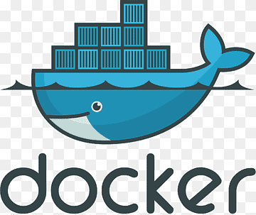

# FilmAPI

FilmAPI - это REST API сервис для управления базой данных фильмов и актеров, представляющий бэкенд приложения "Фильмотека".

## Описание

FilmAPI позволяет пользователям добавлять, получать, изменять и удалять информацию о фильмах и актерах. Приложение обеспечено авторизацией с использованием JWT и разделением ролей пользователей. Администратору доступны все действия, а пользователю - только получение информации о фильмах и актерах.

Язык реализации приложения - Go, используется база данных PostgreSQL.

## Установка

1. Клонируйте репозиторий:

git clone https://github.com/WtoJglg4/filmAPI.git

cd filmAPI

2. Убедитесь, что у вас установлен Docker Engine.

3. Запустите скрипт для запуска приложения:

./run.sh

## Документация API

Получите подробную документацию по API, перейдя по ссылке http://localhost:3000/swagger/ после запуска приложения.

## Автор

Glazov Vadim, WtoJglg4